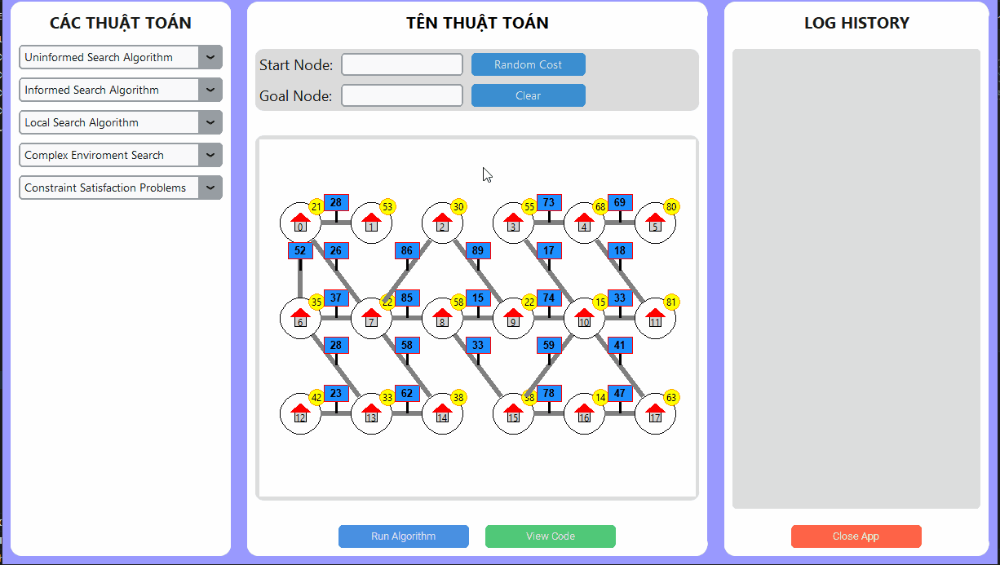

# README NHÓM 07
**Nhóm thực hiện:** 07

**Thành viên:** Nguyễn Sư Thành Đạt
**Mã số sinh viên:** 23110089

**Thành viên:** Trịnh Đại Nghĩa
**Mã số sinh viên:** 23110131

**Thành viên:** Trần Huỳnh Chí Nguyên
**Mã số sinh viên:** 23110136

**Môn học/lớp:** Trí tuệ Nhân tạo/ARIN330585_05CLC

**Ngày nộp:** 15/10/2025

---
## Graph Search Algorithm Visualizer

### Tổng Quan

Chương trình mô phỏng đồ thị trực quan bằng Python, thể hiện bằng GUI với sự hỗ trợ của CustomTkinter, tkinter. Mỗi node được vẽ như một ngôi nhà kèm mặt trời hiển thị trọng số. Mỗi edge là đường thẳng nối hai node, có biển báo chi phí với cây chống thẳng đứng. Node ID và Edge ID là duy nhất, thuận tiện cho truy xuất và chỉnh sửa.

---

### 1. Mục đích xây dựng

Project hướng đến mô phỏng cách các thuật toán tìm kiếm tìm đường đi trên đồ thị. Với Start_node và Goal_Node, thuật toán sẽ dựa trên điểm start và cố gắng tìm đến goal theo logic của thuật toán đó, qua đó ta có thể nhìn nhận, đánh giá từng thuật toán thông qua thời gian và số bước để đi đến goal_node của thuật toán đó.

Project được xây dựng nhằm vận dụng, học hỏi thêm về kiến thức **Trí tuệ Nhân tạo**. Nhóm đã triển khai nhóm thuật toán: 
  - `Uninformed Search`: Breadth-First Search (BFS), Depth-First Search (DFS), Iterative Deeping Search (IDS)
  - `Informed Search`: Greedy Best-First Search, A* Search, Uniform Cost Search (UCS)
  - `Local Search`: Hill Climbing, Simulated Annealing, Genetic
  - `Complex Enviroment`: AND-OR Search, Belief State Search, Partially Observable Search
  - `Constraint Satisfaction Problem Search`: Backtracking, Forward-Checking, AC-3

---

### 2. Tính năng chính
Giao diện mô phỏng trực quan (Main Window): gồm 3 phần
  - Phần bên trái: Nơi chứa các nhóm thuật toán. Dùng để chọn 1 thuật toán bất kỳ.
  - Phần giữa: Thuật toán được chọn sẽ hiển thị ở bên trên. Có 2 phần nhỏ gồm:
    - Phần input: có textbox Start_node và textbot Goal_node dùng để người dùng xác định vị trí bắt đầu và kết thúc trên đồ thị. Có 1 nút Random Cost dùng để random lại Cost trên đồ thị ở phần Mini Map.
    - Phần Mini Map: Một mini map của đồ thị sẽ được show ra ở bên dưới phần input, đó sẽ là đồ thị mà thuật toán dùng để mô phỏng đường đi bắt đầu từ `Start_node` và kết thúc ở `Goal_node`. Có 2 nút ở phần Mini Map:
      - Nút `Run Algorithm`: Bắt đầu chạy thuật toán. Nút `Run Algorithm` sẽ gọi sự kiện và 1 window phụ `RunCodeWindow` sẽ xuất hiện để chạy thuật toán.
      - Nút `View Code`: Một window phụ `ViewCodeWindow` sẽ xuất hiện để cho xem cách nhóm xây dựng thuật toán đang được chọn.
  - Phần bên phải: là 1 Log History, dùng để lưu lại tất cả kết quả tìm thấy được sau mỗi lần chạy 1 thuật toán. Log History sẽ luôn lưu và không mất cho đến khi chương trình được tắt. Có 1 nút `Close App` ở bên dưới Log History

Giao diện RunCodeWindow (Window phụ dùng để chạy thuật toán): có 2 phần
  - Phần đồ thị: dùng để người dùng quan sát cách thuật toán chạy trên thuật toán. Nút `Close` dùng để tắt Window RunCode và quay lại Main Window.
  - Phần log & trạng thái: ghi lại từng bước duyệt và di chuyển của thuật toán. Có thông báo kết quả. Có 2 nút `Bước Trước ` và ` Bước Kế ` giúp người dùng quan sát lại theo từng bước di chuyển. Tránh gây sự khó hiểu khi sử dụng chương trình.

Giao diện ViewCodeWindow (Window phụ dùng để xem các hàm thuật toán): Hàm thuật toán được chọn và các hàm phụ, hàm con sẽ được in ra dưới dạng `readonly`. Có nút `Close` để quay lại Main Window.

---

### 3. Yêu cầu.
- Ngôn ngữ lập trình: `Python`
- Trình sử dụng và quản lý Project: Visual Studio.
- Các thư viện được xài: `customtkinter`, `tkinter`, `math`, `random`.
- Thư viện cần cài đặt: Customtkinter
    Cài trong Command hoặc PowerShell: `pip install customtkinter`

---

### 4. Cách sử dụng

- Chạy ứng dụng có tên file: `Nhom07_Project_AI.py`
- Chọn thuật toán: có tất cả 5 combobox cho 5 nhóm thuật toán.
  - Chọn 1 thuật toán trong 5 nhóm thuật toán.
  - Khi chọn xong, các combobox còn lại sẽ tự động khóa
- Chạy thuật toán:
  - Chọn Start_node và Goal_Node. Có thể tùy ý nhấn `Random Cost` để đây đổi Cost. 
  - Nhấn nút `Run` để bắt đầu chạy thuật toán.
  - Quan sát thuật toán chạy trên đồ thị. Đồng thời phần `Log & Trạng thái ` sẽ luôn cập nhật cho mỗi bước đi thành công.
- Để chạy lại thuật toán: Có thể nhấn nút ` Bước Trước ` tới khi nào phần hiển thị ` Bước 0/... `. Hoặc ta sẽ tắt window đó và chọn `Run` lại.
    -  Có thể chọn một thuật toán khác để chạy, có thể random cost mới nhưng Log-History sẽ luôn ghi nhận.
- Có thể xem qua đoạn code thuật toán đang chọn thông qua View Code.

---

### 5. Cấu trúc Code

- File Nhom07_Project_AI.py chính để chạy chương trình
- 1 Module, trong đó gồm:
    - CenterWindow.py: file căn giữa Window
    - GraphData.py: file dữ liệu đồ thị
    - GraphVisualizer.py: file tạo đồ thị
    - UIComponents.py: file UI chính của chương trình
    - UninformedSearch.py: file chứa các hàm thuật toán: Breadth-First Search (BFS), Depth-First Search (DFS), Iterative Deeping Search (IDS)
    - InformedSearch.py: file chứa các hàm thuật toán: Greedy Best-First Search, A* Search, Uniform Cost Search (UCS)
    - LocalSearch.py: file chứa các hàm thuật toán: Hill Climbing, Simulated Annealing, Genetic
    - ComplexEnviroment.py: file chứa các hàm thuật toán: AND-OR Search, Belief State Search, Partially Observable Search
    - CSP.py: file chứa các hàm thuật toán: Backtracking, Forward-Checking, AC-3
    - RunCodeWindow.py: file chạy thuật toán
    - ViewCodeWindow.py: file view hàm thuật toán
      
---

### 6. Kết Quả Thực Nghiệm

Chắc chắn rồi\! Dưới đây là phiên bản chi tiết và mở rộng cho mục "Kết quả thực nghiệm", phân tích sâu hơn về từng thuật toán dựa trên mã nguồn bạn đã cung cấp.

-----

### **6. Kết Quả Thực Nghiệm**

#### **1. Uninformed Search (Tìm kiếm không có thông tin)**

  * **Breadth-First Search (BFS)**

      * **Đặc trưng:** Thuật toán duyệt đồ thị theo từng tầng (level-by-level). Nó sử dụng một hàng đợi (queue) để quản lý các node sẽ được duyệt tiếp theo. Trong code, hàm `BFS` sử dụng `collections.deque` làm hàng đợi và một tập `visited` để tránh duyệt lại các node đã đi qua, đảm bảo mỗi node chỉ được khám phá một lần.
      * **Phân tích và đánh giá:**
          * **Tính hoàn chỉnh:** Có. BFS luôn đảm bảo tìm ra lời giải nếu nó tồn tại.
          * **Tính tối ưu:** Có. BFS luôn tìm được đường đi có số lượng cạnh ít nhất từ điểm bắt đầu đến điểm kết thúc.
          * **Độ phức tạp:** Thời gian và không gian bộ nhớ đều lớn (`O(b^d)`, với `b` là số nhánh trung bình và `d` là độ sâu của lời giải), vì nó phải lưu trữ tất cả các node ở mỗi tầng. Đây là nhược điểm lớn nhất của BFS.

  * **Depth-First Search (DFS)**

      * **Đặc trưng:** Ưu tiên đi sâu nhất có thể theo một nhánh trước khi quay lui (backtrack). Thuật toán này sử dụng một ngăn xếp (stack) để quản lý các node. Trong file `UninformedSearch.py`, hàm `dfs` triển khai logic này bằng cách dùng một list làm stack và thêm các hàng xóm vào stack theo thứ tự đảo ngược để ưu tiên duyệt nhánh đầu tiên.
      * **Phân tích và đánh giá:**
          * **Tính hoàn chỉnh:** Không. DFS có thể bị kẹt trong một nhánh có độ sâu vô hạn và không bao giờ tìm ra lời giải.
          * **Tính tối ưu:** Không. Lời giải đầu tiên DFS tìm thấy không chắc đã là lời giải ngắn nhất.
          * **Độ phức tạp:** Yêu cầu bộ nhớ ít hơn nhiều so với BFS (`O(b*d)`), vì chỉ cần lưu trữ các node trên đường đi hiện tại. Tuy nhiên, thời gian chạy có thể rất kém nếu nó đi sai hướng.

  * **Iterative Deepening Search (IDS)**

      * **Đặc trưng:** Là sự kết hợp thông minh giữa BFS và DFS. IDS thực hiện một loạt các cuộc gọi DFS với giới hạn độ sâu tăng dần (depth-limited search). Nó bắt đầu với độ sâu 0, sau đó 1, 2, và cứ thế cho đến khi tìm thấy lời giải. Điều này giúp nó có được ưu điểm của cả hai thuật toán.
      * **Phân tích và đánh giá:**
          * **Tính hoàn chỉnh và tối ưu:** Có, giống như BFS.
          * **Độ phức tạp:** Mặc dù phải duyệt lại các node ở tầng trên nhiều lần, chi phí này không đáng kể. Độ phức tạp không gian của nó (`O(b*d)`) tốt như DFS và độ phức tạp thời gian (`O(b^d)`) tương đương BFS. IDS thường là thuật toán tìm kiếm mù tốt nhất khi không gian tìm kiếm lớn và không rõ độ sâu của lời giải.

-----

#### **2. Informed Search (Tìm kiếm có thông tin)** heuristics.

Sử dụng hàm heuristic `h(n)` để ước tính chi phí từ một node `n` đến đích. Trong dự án này, hàm `heuristic` được định nghĩa trong `InformedSearch.py` là khoảng cách Euclid, giúp thuật toán "thông minh" hơn trong việc lựa chọn đường đi.

  * **Greedy Best-First Search**

      * **Đặc trưng:** Là một thuật toán "tham lam". Tại mỗi bước, nó luôn chọn đi đến node có giá trị heuristic `h(n)` nhỏ nhất, tức là node được cho là gần đích nhất mà không quan tâm đến chi phí đã đi. Nó sử dụng hàng đợi ưu tiên (priority queue) để quản lý các node dựa trên giá trị `h(n)`.
      * **Phân tích và đánh giá:**
          * **Tính hoàn chỉnh và tối ưu:** Không. Sự "tham lam" có thể dẫn nó vào ngõ cụt hoặc chọn một con đường dài hơn về tổng chi phí.
          * **Ưu điểm:** Rất nhanh và hiệu quả trong việc tìm ra một lời giải nào đó, dù không phải là tốt nhất.

  * **A\* Search**

      * **Đặc trưng:** Là thuật toán tìm kiếm nổi tiếng nhất. Nó cân bằng giữa chi phí thực tế đã đi `g(n)` và chi phí ước tính đến đích `h(n)`. Node được ưu tiên mở rộng là node có tổng `f(n) = g(n) + h(n)` nhỏ nhất. Việc triển khai sử dụng hàng đợi ưu tiên để lưu trữ các tuple `(f_score, g_score, node)`.
      * **Phân tích và đánh giá:**
          * **Tính hoàn chỉnh và tối ưu:** Có, với điều kiện hàm heuristic là "chấp nhận được" (admissible), tức là không bao giờ đánh giá cao hơn chi phí thực tế. Khoảng cách Euclid là một heuristic chấp nhận được. A\* được xem là thuật toán tối ưu nhất trong số các thuật toán tìm kiếm có thông tin.

  * **Uniform Cost Search (UCS)**

      * **Đặc trưng:** Có thể xem là một trường hợp đặc biệt của A\* với `h(n) = 0`. Nó luôn mở rộng node có tổng chi phí đường đi `g(n)` thấp nhất tính từ điểm xuất phát. Về bản chất, nó chính là thuật toán Dijkstra. Code triển khai sử dụng hàng đợi ưu tiên để sắp xếp các node theo `cost`.
      * **Phân tích và đánh giá:**
          * **Tính hoàn chỉnh và tối ưu:** Có. Nó luôn đảm bảo tìm được đường đi với tổng chi phí thấp nhất. Tuy nhiên, nó duyệt không có định hướng và có thể mở rộng nhiều node không cần thiết so với A\*.

-----

#### **3. Local Search (Tìm kiếm cục bộ)** ⛰️

Các thuật toán này không quan tâm đến đường đi mà chỉ tập trung vào trạng thái hiện tại và cố gắng di chuyển đến một trạng thái tốt hơn, thường được áp dụng cho các bài toán tối ưu hóa.

  * **Hill Climbing**

      * **Đặc trưng:** Là một vòng lặp đơn giản, liên tục di chuyển theo hướng "dốc lên" (tức là đến node lân cận có giá trị heuristic tốt hơn). Nó sẽ dừng lại khi đến một "đỉnh" mà không có lân cận nào tốt hơn. Trong code, vòng lặp `while True` sẽ tìm `next` node là `min` của các hàng xóm dựa trên `heuristic` và sẽ `break` nếu `heuristic` của `next` không tốt hơn `cur`.
      * **Phân tích và đánh giá:**
          * **Nhược điểm:** Rất dễ bị kẹt ở "cực đại địa phương" (local maxima), "bình nguyên" (plateau) hoặc "sườn núi" (ridge), dẫn đến không tìm được lời giải tối ưu toàn cục.
          * **Ưu điểm:** Cực kỳ tiết kiệm bộ nhớ vì chỉ cần lưu trạng thái hiện tại.

  * **Simulated Annealing (Luyện kim mô phỏng)**

      * **Đặc trưng:** Là một cải tiến của Hill Climbing. Nó cho phép thực hiện các bước đi "xấu hơn" (xuống dốc) với một xác suất nhất định, giúp thoát khỏi các cực đại địa phương. Xác suất này được kiểm soát bởi một tham số "nhiệt độ" (`T`), `T` sẽ giảm dần theo thời gian. Khi `T` cao, thuật toán khám phá rất ngẫu nhiên; khi `T` thấp, nó hoạt động giống Hill Climbing.
      * **Phân tích và đánh giá:**
          * **Ưu điểm:** Có khả năng tìm được lời giải tối ưu toàn cục cao hơn nhiều so với Hill Climbing nếu lịch trình "làm nguội" (cooling schedule) được chọn phù hợp.

  * **Genetic Algorithm (Thuật toán di truyền)**

      * **Đặc trưng:** Mô phỏng quá trình tiến hóa của sinh vật. Nó duy trì một "quần thể" (population) các giải pháp (các đường đi). Qua mỗi "thế hệ" (generation), các giải pháp tốt nhất được chọn lọc, "lai ghép" (crossover) và "đột biến" (mutation) để tạo ra thế hệ mới có khả năng tốt hơn.
      * **Phân tích và đánh giá:**
          * **Ưu điểm:** Rất mạnh mẽ trong việc khám phá song song nhiều khu vực của không gian tìm kiếm, hiệu quả cho các bài toán tối ưu hóa phức tạp.

-----

#### **4. Complex Environment Search (Tìm kiếm trong môi trường phức tạp)** 🌍

  * **And-OR Search**

      * **Đặc trưng:** Được sử dụng cho các bài toán mà lời giải có thể được phân rã thành các bài toán con. Trong bản triển khai này, nó được "ngụy trang" thành một thuật toán DFS, trong đó việc chọn một nhánh để đi được xem là giải quyết một "OR-node" (chọn một trong nhiều cách), và việc đi từ node hiện tại đến node tiếp theo là một "AND-action" (phải thực hiện hành động này).

  * **Belief State Search**

      * **Đặc trưng:** Áp dụng cho môi trường mà agent không chắc chắn 100% về vị trí hiện tại của mình. Nó tìm kiếm trong không gian của các "trạng thái niềm tin" (belief states), trong đó mỗi belief state là một tập hợp các node mà agent tin rằng mình có thể đang ở đó. Thuật toán sẽ mở rộng belief state bằng cách thêm vào các hàng xóm của tất cả các node trong belief state hiện tại.

  * **Partially Observable Search**

      * **Đặc trưng:** Về cơ bản, đây là một cách tiếp cận khác cho bài toán tìm kiếm với belief state. Trong code, thuật toán này cũng duy trì một belief state và mở rộng nó. Mục tiêu là tìm một chuỗi hành động để dẫn đến một belief state có chứa node đích.

-----

#### **5. Constraint Satisfaction Problems (CSP - Bài toán thỏa mãn ràng buộc)** ✅

Các thuật toán này không tìm đường đi mà tìm một bộ giá trị gán cho các biến sao cho tất cả các ràng buộc được thỏa mãn. Trong ngữ cảnh tìm đường, biến là các bước trong đường đi, và ràng buộc là không được tạo chu trình (không thăm lại node đã đi).

  * **Backtracking Search**

      * **Đặc trưng:** Là một thuật toán DFS cơ bản cho CSP. Nó thử gán giá trị cho từng biến. Nếu việc gán giá trị vi phạm ràng buộc, nó sẽ "quay lui" (backtrack) và thử giá trị khác. Ràng buộc chính trong hàm `backtrack` là `if neighbor not in path`, ngăn thuật toán đi vào một node đã có trong đường đi hiện tại.

  * **Forward-Checking**

      * **Đặc trưng:** Là một phiên bản thông minh hơn của Backtracking. Mỗi khi một node được chọn (`next_n`), hàm `forwardcheck` sẽ tạo ra một `new_domains` (miền giá trị mới) cho các node còn lại bằng cách loại bỏ `next_n` khỏi danh sách hàng xóm của chúng. Điều này giúp phát hiện ra các nhánh tìm kiếm vô nghiệm sớm hơn nhiều.

  * **AC-3**

      * **Đặc trưng:** Thuật toán này không phải là một thuật toán tìm kiếm hoàn chỉnh, mà là một công cụ tiền xử lý hoặc tích hợp vào tìm kiếm. Mục tiêu của nó là thực thi "tính nhất quán cung" (arc consistency). Nó loại bỏ các giá trị trong miền giá trị của một biến nếu không tồn tại giá trị tương ứng ở biến lân cận để thỏa mãn ràng buộc. Trong hàm `AC3Search`, đầu tiên `ac3` được chạy để "élagage" (cắt tỉa) đồ thị, sau đó `BacktrackingSearch` được chạy trên đồ thị đã được rút gọn đó, giúp tăng tốc độ tìm kiếm đáng kể.
